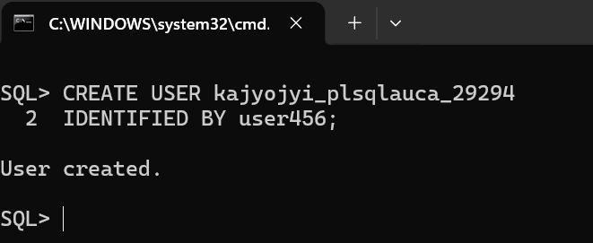
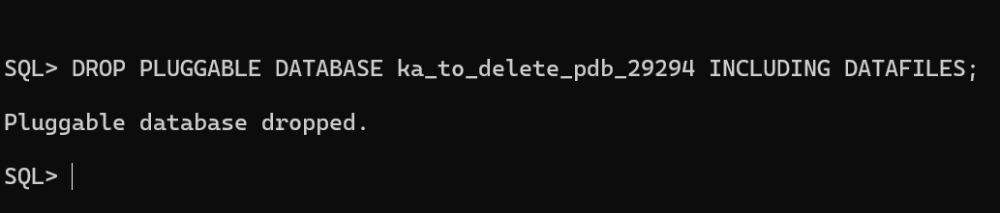

# Oracle Pluggable Databases Assignment II

Course: INSY 8311 -- Database Development with PL/SQL

## Student Information

Name: Kajyojyi Ntwari David\
Student ID: 29294

## Assignment Overview

This assignment demonstrates practical implementation of Oracle
Multitenant Architecture through creation, management, and deletion of
Pluggable Databases (PDBs). All operations were performed using
SQL\*Plus via the Command Line.

## Oracle Environment

Operating System: Windows 11\
Oracle Version: Oracle Database 21c\
Tool Used: SQL\*Plus (CMD)\
Monitoring Tool: Oracle Enterprise Manager (OEM)

## Task 1: Create a New Pluggable Database

A new Pluggable Database (PDB) was created from the CDB\$ROOT container.
The PDB was opened in READ WRITE mode and a dedicated user was created
inside the PDB for coursework activities.

Screenshots included: - PDB creation command and result - PDB open state
confirmation - User creation inside PDB

## Task 2: Create and Delete a Temporary PDB

A temporary Pluggable Database was created for testing purposes and
later deleted completely, including its datafiles.

Screenshots included: - Temporary PDB creation - Temporary PDB deletion
confirmation

## Task 3: Oracle Enterprise Manager (OEM)

Oracle Enterprise Manager was configured and accessed successfully. The
dashboard shows the Oracle environment and created PDB.

Screenshot included: - OEM dashboard showing the created PDB

## Challenges Encountered

Minor difficulty accessing Oracle Enterprise Manager (OEM), resolved by
following Oracle documentation and verifying services.

## Results Summary

- Created and managed a PDB
- Created and deleted a temporary PDB
- Verified database using SQL\*Plus
- Monitored environment using OEM

## References

Oracle Database 21c Documentation\
INSY 8311 Course Materials\
SQL\*Plus Documentation

## Integrity Statement

I confirm that this work is my own implementation. All commands were
executed personally and documented according to academic integrity
guidelines.

All sources were properly cited. Implementations and analysis represent
original work.
